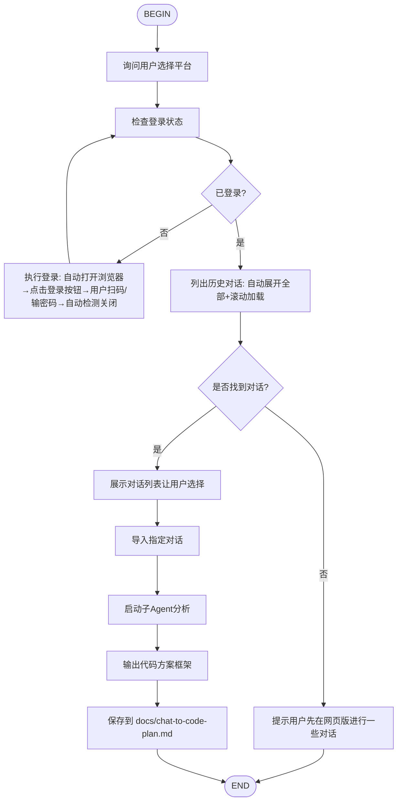

# Chat to Code Flow

从网页版聊天平台自动拉取聊天记录，提炼需求并生成结构化的代码方案框架。

## 支持平台

- **kimi**: kimi.moonshot.cn
- **deepseek**: chat.deepseek.com
- **chatgpt**: chatgpt.com

## 使用方式

```
/flow:chat-to-code
```

或在 VSCode Kimi Code 面板中输入。

## 流程



## 各节点说明

### B. 询问用户选择平台

**这是必须的第一步，不要默认使用 kimi。**

使用 `AskUserQuestion` 展示平台选择：

```
问题: 要从哪个平台导入聊天记录?
选项:
- Kimi (kimi.moonshot.cn)
- DeepSeek (chat.deepseek.com)
- ChatGPT (chatgpt.com)
```

将用户选择的平台值（kimi/deepseek/chatgpt）作为后续所有工具的 `platform` 参数。

### C/D/E. 检查并登录

使用 `kimi_login_status` 检查，如未登录则调用 `kimi_login` 打开浏览器。

### F. 列出历史对话

使用 `list_chat_sessions`（带上 `platform`），自动展开+滚动加载，最多30条。

### J. 展示对话列表并让用户选择

**先以普通文本形式列出全部对话标题（带序号 0-29），让用户能看到完整列表。**

例如：
```
找到以下对话（共 X 条）：
[0] 第一条对话标题
[1] 第二条对话标题
...
[29] 第三十条对话标题
```

然后用 `AskUserQuestion` 提供操作选项：
- 导入最新的（index 0）并生成代码方案
- 我自己回复序号来选择
- 取消

如果用户选择"我自己回复序号来选择"，等待用户在下一条消息中回复序号。

### K. 导入对话

使用 `import_chat_history`（带上 `platform` 和 `index`）。

### L. 启动子Agent分析

启动 `plan` 子Agent，传入 `full_text`。

**子Agent提示模板**：
```
你是一位资深软件架构师。请分析以下从网页版导出的聊天记录，生成代码方案框架。

## 聊天记录
{chat_full_text}

## 输出要求

1. 需求摘要（2-3句话）
2. 功能模块列表（P0/P1/P2优先级）
3. 推荐技术栈
4. 核心数据模型
5. 关键API/接口设计
6. 推荐目录结构（文本树形图）
7. 实现步骤（按依赖排序的待办清单）
8. 风险与注意点

使用Markdown格式输出。
```

### M/N. 输出与保存

将分析结果保存为 `docs/chat-to-code-plan.md`。

## 最佳实践

- **必须先问平台**：三平台完全对等，不要默认使用 kimi
- **长对话处理**：超过50轮的建议先在网页版整理关键轮次
- **登录持久化**：各平台登录态独立保存，互不影响
- **与Plan模式结合**：先生成此框架，再使用 `/plan` 做详细设计
