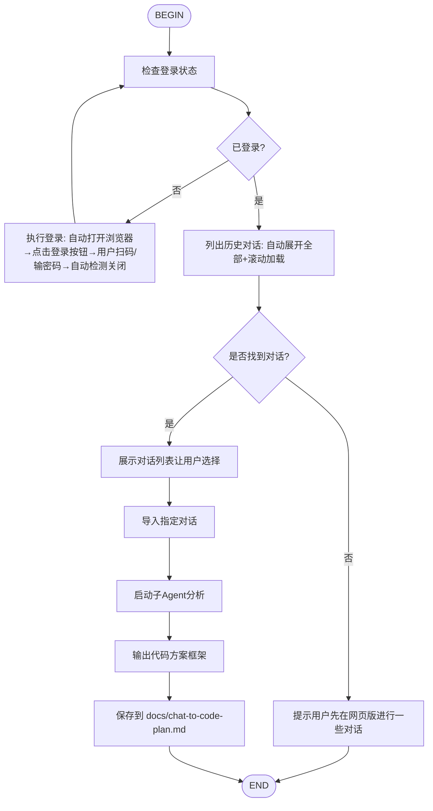

# Chat to Code Flow

从网页版聊天平台自动拉取聊天记录，提炼需求并生成结构化的代码方案框架。

## 支持平台

- **kimi** (默认): kimi.moonshot.cn
- **deepseek**: chat.deepseek.com
- **chatgpt**: chatgpt.com

## 使用方式

```
/flow:chat-to-code
```

或在 VSCode Kimi Code 面板中输入。

## 流程



## 子Agent分析提示模板

```
你是一位资深软件架构师。请分析以下从网页版导出的聊天记录，生成代码方案框架。

## 聊天记录
{chat_full_text}

## 输出要求

1. 需求摘要（2-3句话）
2. 功能模块列表（P0/P1/P2优先级）
3. 推荐技术栈
4. 核心数据模型
5. 关键API/接口设计
6. 推荐目录结构（文本树形图）
7. 实现步骤（按依赖排序的待办清单）
8. 风险与注意点

使用Markdown格式输出。
```

## 最佳实践

- **切换平台**: 默认使用 kimi，如需导入 DeepSeek 或 ChatGPT，在调用时指定 platform 参数
- **长对话处理**: 超过50轮的建议先在网页版整理关键轮次
- **登录持久化**: 各平台登录态独立保存，互不影响
- **与Plan模式结合**: 先生成此框架，再使用 `/plan` 做详细设计
