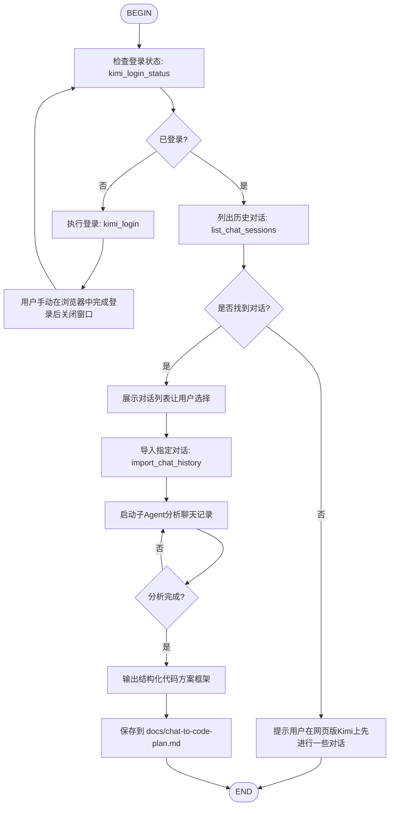

# Chat to Code Flow

从网页版Kimi自动拉取聊天记录，提炼需求并生成结构化的代码方案框架。

## 适用场景

- 你在网页版Kimi上进行了长时间的需求讨论
- 需要将讨论结果转化为可执行的代码实现计划
- 希望自动提取关键需求、约束和技术要点

## 前置准备

1. **完成安装**：运行对应平台的安装脚本（Windows: `install-windows.ps1`, Linux/macOS: `install-linux.sh`）
2. **首次登录**：插件会自动检测登录状态，未登录时会打开浏览器让你手动登录kimi.moonshot.cn
3. **登录状态持久化**：首次登录后，cookie和storage state会保存在 `~/.kimireader/`，后续无需再次登录



## 各节点详细说明

### B. 检查登录状态

使用 `kimi_login_status` 检查是否已有有效的kimi.moonshot.cn登录状态。

### D/E. 交互式登录

使用 `kimi_login` 打开浏览器窗口（headed模式），用户手动完成登录后关闭浏览器，状态自动保存。

### F. 列出历史对话

使用 `list_chat_sessions` 获取网页版Kimi上的历史对话列表。返回每个对话的：
- `session_id`: 会话ID
- `title`: 对话标题
- `url`: 对话URL

### K. 导入聊天记录

使用 `import_chat_history` 提取选定对话的完整消息。参数：
- `index`: 从对话列表中选择的序号（0-based），最方便的方式
- 或 `session_id`: 指定会话ID
- 或 `url`: 指定完整URL

### L. 启动子Agent分析

启动 `plan` 类型的子Agent，将聊天记录 `full_text` 传递给它。

**子Agent提示模板**：
```
你是一位资深软件架构师。请分析以下从Kimi网页版导出的聊天记录，提取关键信息并生成代码方案框架。

## 聊天记录
{chat_full_text}

## 分析要求

1. **需求摘要**：用2-3句话概括核心需求
2. **功能模块**：列出所有需要实现的功能模块（含优先级P0/P1/P2）
3. **技术栈建议**：推荐合适的技术栈和架构模式
4. **数据模型**：核心实体和它们的关系
5. **API/接口设计**：关键接口的定义（方法名、参数、返回值）
6. **代码结构**：推荐的目录结构和关键文件
7. **实现步骤**：按依赖关系排序的实现任务列表
8. **风险与注意点**：潜在的技术难点和边界情况

## 输出格式

请使用Markdown格式输出，包含：
- 一个可执行的待办清单（复选框格式）
- 代码目录树（使用文本树形图）
- 关键模块的伪代码或接口定义
```

### N/O. 输出与保存

将子Agent分析结果保存为 `docs/chat-to-code-plan.md`。

## 使用方式

在 Kimi Code CLI 中执行：

```sh
/flow:chat-to-code
```

或在 VSCode Kimi Code 面板中输入：

```
/flow:chat-to-code
```

## 最佳实践

- **长对话处理**：如果聊天记录超过50轮，建议先在网页版整理关键轮次
- **多轮迭代**：如果生成的方案不够完善，可以修改 `docs/chat-to-code-plan.md` 后再次调用进行细化
- **与Plan模式结合**：对于复杂项目，先生成此框架，再使用 `/plan` 进入Plan模式做详细设计
- **保持登录**：首次登录后状态会持久化，但cookie可能过期（通常几个月），过期后需重新登录
